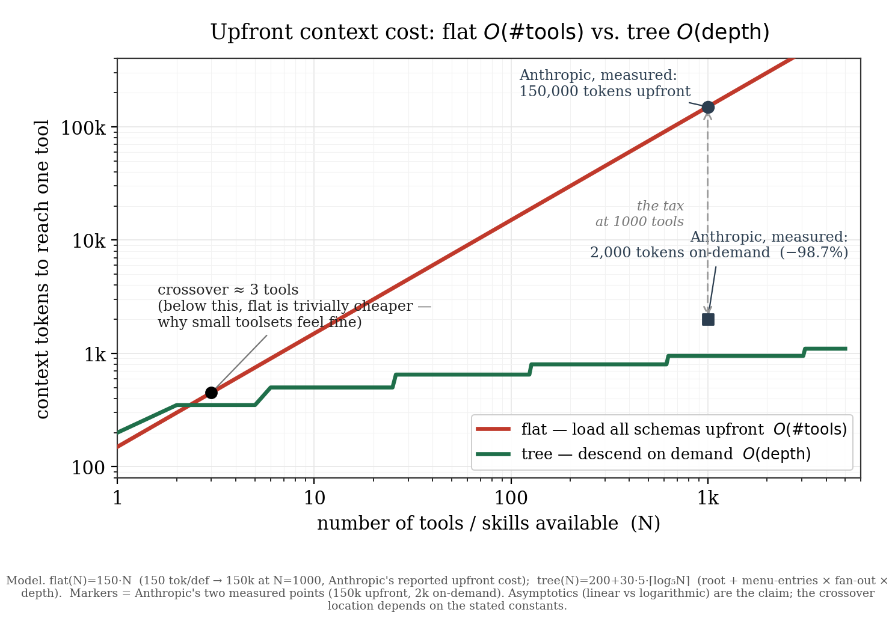

# Flat versus Tree: Why Agent Skills Need a Graph

**Isaac Wostrel-Rubin** · Independent researcher · ORCID [0009-0003-0219-0506](https://orcid.org/0009-0003-0219-0506)
isaacwrubin@gmail.com · github.com/sancovp · Working paper, June 2026

## Abstract

Practitioners building tool-using agents report a counterintuitive failure: as an agent is connected to *more* tools, its ability to select the right one *degrades* rather than improves.[^6] The field's dominant response has been to migrate from MCP toward "skills" on the stated grounds that skills save tokens.[^5] This response is mis-targeted. The token comparison is the wrong axis; the degradation is not a property of MCP, and skills resolve intra-skill loading but not navigation across the library—both leave the skill library a *flat list*, discarding the **latent semantic tree** the skills already form: the general/specific relations a model must reconstruct to use them, at minimum a tree, in the general case a graph. The consequential point for this audience is structural, not ergonomic. An agent in operation is a trajectory through context-states; modeled this way it is a *flow*, and the space it flows over is the library's latent semantic tree—the relations its skills already stand in, which a model must reconstruct to use them. A flat list hands the model the leaves and discards that tree, so it re-derives the structure at every step; a tree (the structure made explicit) or a graph (its general form) supplies it in advance. (One plausible lower-level reason this bites: in-context learning is carried in part by induction heads, circuits that complete `A→B` edges[^1]—edge-shaped machinery starved by an edgeless substrate. We pose this as a suggestive mechanism, not a premise; the argument does not rest on it.) This reframes a cluster of familiar and seemingly unrelated frustrations—context that "melts" at scale, tool selection that worsens with breadth, the unresolved skills-versus-MCP debate, and a feature named "progressive disclosure" that cannot disclose across its own corpus—as a *single, diagnosable error with an inexpensive correction*. We show the correction—structure as a tree traversed in `O(depth)` rather than loaded in `O(#tools)`—and demonstrate the filesystem-level version with tools that install in one command; the measured crossover remains the benchmark this paper specifies rather than a result it claims. The claim is **substrate-correction, not agent-performance**: we make explicit and self-applying the structure the disciplined folder approach already reaches for, so a reader should expect results of *that kind*—delivered by the structure instead of by hand—rather than a new performance high. (The stronger conjecture this suggests—that constructing the structure well enough *is* constructing the agent, "the folders become the agent"—is developed in §8, not claimed here.)

## Background — from programming agents to skills, and what it left open

The field's guidance moved twice. First, away from *programming* agents: the most successful builds were found to use "not… complex frameworks or specialized libraries, but instead… simple, composable patterns."[^14] Then, away from *building agents* at all — rather than a new agent per use case, give one general agent domain-specific **skills**: folders of procedural knowledge loaded on demand,[^7] a shift popularly summarized as "don't build agents, build skills."

That second move is the one this paper examines, because as stated it is incomplete. A skill can carry an agent's *knowledge*, but not its *behavior across a corpus*. The moment there are enough skills to require navigation, the platform's own progressive disclosure does not extend across them (§5): a skill cannot cause a deeper skill to be injected. Exactly two things restore that traversal. One is a **harness**—orchestration code wrapped around the skills—which is the *programming* the field had just spent a release escaping. The other is a **graph**: a structure in which progressive disclosure applies *to itself*, so the corpus is navigable without a program wrapped around it. That is the whole point: the skills move only completes once progressive disclosure closes on itself, and that closure is *structural, not programmatic*. Everything below is the cheapest such structure—a tree on the filesystem (§3–§7)—and the substrate it approximates—a graph (§8).

To state the object precisely. A **skill package** is one local patch of procedural knowledge; a **skill library** is the set of available packages. The library has a **latent semantic tree**: its packages stand in general/specific and part/whole relations to one another *whether or not those relations are encoded anywhere*—the structure is a fact about the skills, not about how they happen to be stored. To use a skill correctly a model must reconstruct that tree from whatever it is handed. A **flat list** hands it the leaves and discards the tree, so the model re-derives the structure on every task; a **tree** is that latent structure made explicit and navigable; a **graph** is its general form, for the cases where a skill belongs under more than one parent. The whole contribution follows in one line: the structure the model needs *already exists* as the library's latent tree, the platform ships it flat, and `skilltree` is the program that makes the latent tree explicit and enforceable—so the model navigates it instead of reassembling it.

## 1. What context structure actually governs

Most builders treat the arrangement of context—what to load, in what order, how to chunk it—as ergonomics: a matter of taste and token budget. It is not. Consider what an agent is while it runs: a trajectory through a sequence of context-states, each transition chosen from what the current state makes available. Modeled this way, the agent is a *flow*, and the space it flows over is precisely the structure of its context—nodes are states, edges are admissible transitions. The arrangement of context is therefore not decoration on top of the agent; it is the space the agent moves in. A flat substrate offers only an unstructured state space—every sibling available, none declared as following another—so at every step the agent must reconstruct which move can follow which. A tree or graph supplies those paths in advance: what can follow from what, what excludes what, where the next descent goes. At the moment of use the structure the agent commits to is acyclic—an unresolved cycle is not a decision procedure—which is why a tree, or a DAG, is the operative shape and not an arbitrary graph.

This is the consequence the field has been paying for without naming. Structure supplies the flow with its admissible moves; flatness withholds them—and withholds them *silently*, because the model still emits fluent output, merely without the structure it would otherwise exploit. The claim is not metaphorical: flatten the context far enough and the space the agent was supposed to move through is gone.

Why is there structure to reconstruct in the first place? Because meaning is not constituted as a list. A list merely orders items; meaning comes from the typed relations *among* them—containment, specialization, contrast, dependency, sequence, inheritance, transformation—and those relations are tree- and graph-shaped. They are present in a skill library whether or not the directory encodes them: meaning can be *serialized* as a list, but it is not *constituted* as one. A model, moreover, carries those relations only softly—attention-mediated and implicit—and cannot make them durable and explicit unless the substrate does. A flat list therefore hands the model exactly the serialization that has dropped the relations that gave the items their meaning, and asks it to recover them on every pass.

### 1.1 A note on mechanism (optional, not load-bearing)

The structural claim of §1 stands on its own; this subsection offers two reasons to expect it, neither of which the argument requires. First, a plausible lower-level account: a leading mechanistic study of in-context learning identifies *induction heads*—attention circuits that, having attended to `[A][B]` earlier in a sequence, complete a later `[A]` with `[B]`.[^1] The evidence is strongest in small attention-only models and more indirect in large ones; we take from it only the *shape* of the operation, `A→B`, a directed edge—and edge-shaped machinery has little to lock onto in an edgeless substrate. Second, and independent of any mechanism, models are documented to degrade when relevant content is buried among irrelevant content[^2]: the same loss seen from the outside. Treat both as corroboration of the structural claim, not as its foundation.

## 2. Why a default is an ecosystem tax

This would be a private matter of taste if these tools were products. They are infrastructure: a population of builders stands on the platform's defaults, so a default that mis-shapes context is not one team's cost but a levy paid across every project built on top, continuously.[^3] And this is no longer one vendor's default: the skill runtime has become an open standard, implemented in much the same way across the field,[^15] so the reach of the default is the reach of the standard. The scope of that standard is itself the diagnosis—it successfully standardizes the *unit* of procedural capability, the skill package, but not the *graph over units*, the relations between skills. The node is standardized; the edge is not. And the missing edge is a specific thing: not a hyperlink but a *state transition*. In a state machine a transition does not merely name the next state—it enters it; a skill-to-skill relation (A specializes into B, delegates to C, must be followed by D) has to *inject* the next skill into the working context, or the relation is only prose. The standard fixes the package and withholds this transition operator over packages, which is why builders end up rebuilding the missing state machine as an external harness—the very programming the skills move was meant to retire (Background). The missing latent tree (§1) is therefore a shared gap, multiplied across every platform that adopted the unit without the structure. No intent is claimed, and none is required—the shape of the failure is identical whether it was chosen or merely shipped quickly. What the reader pays is concrete: building on the substrate correctly is the capability that was not provided, and the capabilities that *were* provided stand in the way of building it oneself.

## 3. One bug behind a dozen complaints

The frustrations practitioners report look unrelated; they are one bug. In each case the platform ships the nodes and omits the first-class edge that would connect them. Conversations arrive as a flat list—grouping exists, but groups cannot reference one another, so cross-group review is assembled by hand; a single tagging primitive would have made a graph. Agents can be defined but cannot be composed as first-class, observable subcalls without dropping to lower-level orchestration code, at which point the visible product surface no longer carries the nesting relationship.[^4] Skills carry a description but cannot cause a deeper skill to be injected (§5). The complaints differ; the missing edge is the same—and §1 has already identified agent operation as exactly the process that edges structure. Seen this way, the list stops being a backlog of feature requests and becomes a single diagnosis.

## 4. The migration that solved the wrong problem

Much of the ecosystem has rearchitected on one piece of guidance: prefer skills (or code execution) to direct MCP tool-calling, because loading all tool definitions wastes tokens. The platform states the cost in its own words—agents connected to many tools "need to process hundreds of thousands of tokens before reading a request," and loading on demand cut usage "from 150,000 tokens to 2,000 tokens—a … saving of 98.7%."[^5] The number is real; the framing is not. It compares two representations of tools and asks which is cheaper, which is the wrong axis. Per unit the two are roughly even—a JSON schema is a docstring, and a wrapping skill exposes code of comparable size. The difference is the *loading model*: every schema upfront versus a tool *tree* descended on demand,[^16] `O(#tools)` versus `O(depth)` (Figure 1). The selection failures that appear past a threshold of available tools[^6] are the symptom of the flat loading model, not of MCP. So the migration does not restore the library's latent tree—it moves a flat representation to a different flat representation. That the destination is contested on its own terms is already on record: an independent evaluation reports a small curated documentation index outperforming skills (a 100% pass rate against 79%, with skills left uninvoked more than half the time)[^12]—and a small curated index is precisely what the root of a tree looks like. The resolution on either side is the same: impose a tree. Figure 1 is an asymptotic model, not a measured benchmark: it visualizes the structural prediction implied by the sources above—flat exposure grows with the number of tools, descended exposure with the number of levels traversed—while the empirical crossover remains to be measured. The `O(depth)` bound assumes a bounded branching factor, branch summaries informative enough to choose the right child, traversal errors that are rare or recoverable, and tasks that usually need one branch rather than many siblings at once; where those assumptions fail, descent costs more than the bound suggests.



> **Figure 1. Upfront context cost: flat `O(#tools)` versus tree `O(depth)`.** The flat curve loads every tool definition before the first request; the tree curve descends a branching menu, reading only one node's children per level. The two square/circle markers are Anthropic's own measured points—150,000 tokens loaded upfront and 2,000 tokens on-demand, a 98.7% reduction[^5]; the model is calibrated so the flat line passes exactly through the former. The robust content is the asymptotics—flat is linear in the number of tools, the tree depth-bounded under a fixed branching assumption—and the crossover: below a handful of tools the flat load is trivially cheaper, which is why small toolsets feel fine and the tax goes unnoticed; past it the linear cost explodes while the tree stays nearly flat. *(Model: flat(N)=150·N; tree(N)=200+30·5·⌈log₅N⌉. The crossover location depends on these constants; the divergence does not. Generated by `figures/figure1_crossover.py`; vector master at `figures/figure1_crossover.svg`.)*

## 5. A principle sold to you that cannot apply to itself

The sharpest case is also where the platform's own terminology makes the missing recursion most visible, and it must be stated precisely because the casual version is false. "Progressive disclosure" is the platform's own term—a section heading in the same post, where the remedy is to "read tool definitions on-demand, rather than reading them all up-front."[^5] And skills *do* disclose progressively *within* a skill: a three-level descent from frontmatter to body to referenced files.[^7] The failure is at the boundary—a skill cannot cause another skill to be injected into the harness. Progressive disclosure is recursive by nature; a tree discloses at every node, not only the root. A depth-one implementation therefore cannot apply the principle to itself: one discloses *into* a skill but never *from* one skill into a more specific one. The feature was named for the tree and shipped as a star—one center, depth-one leaves, no descent—and a set of stars with no connecting edges is a flat forest, precisely at the scale (a corpus of hundreds of skills) where disclosure was the point. This is not an omission to be patched by more prose inside a skill: the public skill primitive provides no first-class skill-to-skill edge—a skill can disclose its own files but cannot recursively disclose the skill corpus as a navigable tree—so the recursion is structurally foreclosed. What the reader needs is therefore not a richer skill but the missing level itself (§7).

## 6. Where the folder approach breaks, and why

Rather than argue from first principles, we ran the most disciplined instance of the flat-folder approach—the Interpretable Context Methodology, "folders, not agents"[^8]—with a standard model (deliberately not an enhanced one, so we measure the system and not the agent) on a course-deck-production task: two staged passes, extraction then curriculum, over a short source, run straight and then debriefed. The reader need not guess where it holds. This is an engineering case study, not a controlled benchmark: the claim is about observed failure modes in a standard non-interactive run, not population-level performance across all folder workflows. It holds for repeatable, human-reviewed workflows, and its value is locatable: an explicit inputs table, an audit step that forces verification before output, and context scoping. Tellingly, the lift came from the *structure*—the tagged schema, the staged contracts—not the surrounding prose, exactly as §1 predicts. And it breaks predictably the moment the human steps out: checkpoints stall a non-interactive agent, the inter-stage hand-off is fragile (shared state copied forward with no canonical owner; an under-specified naming convention that silently mismatches), and the audit is shallow enough to pass plausible-but-incorrect output. The lesson is not that folders are wrong but that a flat substrate carries structure only while a human supplies the missing edges by hand—which does not scale, and is not autonomy. ICM is the empirical clue: folders help because they approximate a context graph. The corrective is therefore *not a better agent than ICM's*; it is that graph made explicit and self-maintaining—supplied by the tree instead of by a human's hand. A reader should expect results of ICM's kind, carried by the structure rather than reconstructed each run, not a new performance record.

## 7. The correction, already running

The correction restores structure one axis at a time, as tools that install in a single command and were verified at the level of CLI execution, filesystem mutation, generated output, and observed runtime loading behavior—not by assertion. `skilltree map` renders a flat skill folder as a coordinate-addressed, navigable tree—the missing level of §5. `skilltree search` provides zero-dependency retrieval over any folder, with a coordinate `--scope` that restricts it to a subtree. The same tool's `discover`/`cohere`/`emit`/`unemit` loop (Appendix A) keeps the materialized tree coherent as the corpus changes. Each closes one of the loops §3 left open. The contribution is not algorithmic—most of the machinery is commodity—it is the supply of structure, at zero configuration, to a reader (and a model) that otherwise cannot construct it. A temporal axis—a state machine over the tree, restoring cross-turn memory—is in progress and is not claimed here as complete.

## 8. The substrate you should have been given

Stated as a demand rather than a description: a single tree that self-manages, and an agent that can navigate it. The tools above approximate this on the filesystem because the filesystem is the *weakest* substrate that supports it—lacking first-class edges, it must emulate them, with coordinates standing in for identity and breadcrumbs for edges. A substrate with first-class, typed relationships—a graph—is the native form of that latent structure: it holds the relations directly rather than emulating them.[^9] More precisely, there is no single canonical tree: the latent structure is a *hypergraph*, and any one tree is a *chart* selected from it for a purpose—the same skills organize into different trees under different relations. The latent tree of §1 is the chart a given task takes; the general substrate is the hypergraph that holds them all. Systems such as OpenCog Hyperon already show the upper bound: graph-shaped cognition treated as an AGI architecture.[^10] But Hyperon sits above the bridge layer this paper targets—it asks the user to enter a formal metagraph programming environment before any structure is gained. The missing layer is the same insight made runnable for the terminal-capable operator who can run an agent and let it modify local files: folders, coordinates, commands, scoped loading, and descent. The binding constraint there is runnability, not power. A minimal, dependency-free graph-native form of the mechanism is provided as a small experimental tool[^17]—skills as nodes, typed relations as edges where an edge is a *state transition that injects context*, with tree-charts derived from the hypergraph on demand—the runnable floor to Hyperon's ceiling. This paper does not specify the maximal substrate. It establishes only what the reader can act on now: the operation being built is graph-shaped (§1), the prevailing defaults are flat, and the distance between them is inexpensive to close.

This is also where the practitioner's intuition that "the folders become the agent" becomes precise rather than mystical. If the agent is a flow and the graph is the space it flows over (§1), then constructing the context-graph is not configuring a tool the agent *uses*—it is building the space the agent *is*. Reified far enough, the structure is not consulted by the agent from outside; it is what the agent runs as. We state this as the organizing conjecture, not a proven result: the filesystem tree is the runnable first step toward that identity, a graph is its native form, and the empirical content—how far a constructed structure can stand in for a hand-built agent—is exactly what the benchmark this paper specifies would measure. (The soundness layer required to operate such a substrate autonomously is out of scope.)

## 9. Why this is tractable now, and was not before

None of this required an architectural breakthrough—hierarchical agents that select their own minimal toolkit are modest to build. The decisive change is not that trees became possible but that tool and skill corpora grew large enough for flat exposure to fail visibly. Two conditions delayed it, and both have lifted. Models were not previously reliable enough at instruction-following and tool use to drive their own navigation of a tree;[^11] that constraint has weakened enough to make tree navigation practical in ordinary agent loops. And the tools were built flat—which is a default, not a law.[^13] The reader who felt the problem of §3 now has both the reason it persisted and the evidence that the cost of removing it is small.

## 10. The unified artifact, and what it is not yet

A candid limitation bounds the contribution, and stating it plainly is part of the argument. This paper does not prove that trees outperform flat tool lists on arbitrary agent tasks; it argues that flat exposure creates a structural scaling failure, demonstrates a filesystem-level correction, and specifies the benchmark needed to measure the crossover. Stated positively, the claim is **substrate-correction, not agent-performance**: the skills primitive cannot express the skill library's latent tree—it provides no skill-to-skill edge—so that tree (in general, a graph) is the required shape, and skilltree supplies the missing layer; the result a reader should expect is ICM-class, made explicit and self-applying, not a performance record. The tools of §7 are separate single-purpose programs; the substrate of §8 is named only as a demand. Between them sits an engineering problem that remains open, and is not solved in this paper. The goal is one structure that is, simultaneously, four things: (i) a *development* tree one builds and reasons inside; (ii) an *installable plugin*, distributed and versioned through the platform's marketplace; (iii) a *forkable template* any agent can adopt wholesale as its own starting structure; and (iv) a thing *served*—as an MCP endpoint or a skill-pack—to consumers who never see its internals. Each packaging pulls the layout a different way, and the ways conflict: the development tree wants nested directories with edges emulated by breadcrumbs; the plugin wants a flat, served `skills/` directory under a manifest; the forkable template wants self-containment with no external references; the served surface wants a stable external namespace independent of the internal one. The same skill must, under these four readings, sit in four different places without being copied four times and drifting. Reconciling them into a single self-consistent geometry is unfinished work, and we decline to present a design we do not have.

This is deliberately the *last* level of the program, not the first. Above it sits a further layer still—the composition of trees into reusable higher-order structures (a "framework" layer; the working name, *nomicon* or otherwise, is unsettled), and the means by which such structures are authored, named, and shared—which is deferred in full to subsequent papers. What the present paper rests on is the level *below* the packaging: that agent operation is graph-shaped (§1), that the prevailing defaults are flat, and that a tree closes the gap cheaply (§7, Appendix A). That result does not depend on the unified artifact existing; it depends only on the base code, which runs today. Accordingly we ship the base code as a public repository and claim nothing more for it—not that it is yet a plugin, a template, or a service, only that it demonstrates the correction and that the packaging is later, tractable engineering rather than a precondition. To conflate "the fix exists" with "the fix is packaged for every consumer at once" would be exactly the overclaim §2's argument forbids us; the honest statement is that the structural correction is implemented and the distribution geometry is open.

> **Program note.** This paper is the first layer of a larger program; it addresses only the skill library's latent tree—making it explicit and navigable. Later layers treat notation construction, skill composition, retrieval steering, and exchange/federation across trees. Each is deferred to its own work; none is claimed here.

---

## Notes
[^1]: Catherine Olsson, Nelson Elhage, et al., "In-context Learning and Induction Heads," *Transformer Circuits Thread* (Anthropic), 2022 (transformer-circuits.pub/2022/in-context-learning-and-induction-heads; also arXiv:2209.11895). See also Nelson Elhage et al., "A Mathematical Framework for Transformer Circuits," *Transformer Circuits Thread*, 2021.
[^2]: Nelson F. Liu et al., "Lost in the Middle: How Language Models Use Long Contexts," arXiv:2307.03172, 2023; published in *Transactions of the Association for Computational Linguistics* 12 (2024): 157–173.
[^3]: Susan Leigh Star and Karen Ruhleder, "Steps Toward an Ecology of Infrastructure: Design and Access for Large Information Spaces," *Information Systems Research* 7, no. 1 (1996): 111–134, doi:10.1287/isre.7.1.111.
[^4]: Practitioner observation from tested agent runtimes: agent nesting can be implemented through lower-level orchestration code, but not as a first-class, platform-visible edge in the product surface.
[^5]: Anthropic, "Code execution with MCP: Building more efficient agents," *Anthropic Engineering* (blog), Nov. 4, 2025, anthropic.com/engineering/code-execution-with-mcp. The source states that agents connected to thousands of tools "need to process hundreds of thousands of tokens before reading a request" and that on-demand loading "reduces the token usage from 150,000 tokens to 2,000 tokens—a … saving of 98.7%," under a section headed "Progressive disclosure."
[^6]: Tiantian Gan and Qiyao Sun, "RAG-MCP: Mitigating Prompt Bloat in LLM Tool Selection via Retrieval-Augmented Generation," arXiv:2505.03275, 2025 (reports severe tool-selection difficulty in large MCP tool pools—13.62% baseline selection accuracy, raised to 43.13% by retrieving before selecting); Zhengliang Shi et al., "Retrieval Models Aren't Tool-Savvy: Benchmarking Tool Retrieval for Large Language Models" (ToolRet), arXiv:2503.01763, 2025.
[^7]: Anthropic, "Agent Skills," documentation, platform.claude.com/docs/en/agents-and-tools/agent-skills/overview (three levels of loading: metadata/frontmatter, always loaded → instructions/body, loaded when triggered → resources and code, loaded as needed).
[^8]: Jake Van Clief and David McDermott, "Interpretable Context Methodology: Folder Structure as Agentic Architecture," arXiv:2603.16021, 2026; repository github.com/RinDig/Interpreted-Context-Methdology (slug reproduced verbatim, including its spelling).
[^9]: Aidan Hogan et al., "Knowledge Graphs," *ACM Computing Surveys* 54, no. 4, art. 71 (2021), doi:10.1145/3447772, §3.4 (reification: promotion of a statement to a first-class, typed object via RDF reification, n-ary relations, or singleton properties).
[^10]: Ben Goertzel et al., "OpenCog Hyperon: A Framework for AGI at the Human Level and Beyond," arXiv:2310.18318, 2023 (AtomSpace / MeTTa).
[^11]: Jeffrey Zhou et al., "Instruction-Following Evaluation for Large Language Models" (IFEval), arXiv:2311.07911, 2023, as a dated instruction-following milestone; for tool-use reliability specifically cf. Yujia Qin et al., "ToolLLM," arXiv:2307.16789, 2023.
[^12]: Jude Gao, "AGENTS.md outperforms skills in our agent evals," *Vercel* (blog), Jan. 27, 2026, vercel.com/blog/agents-md-outperforms-skills-in-our-agent-evals (an 8 KB docs index reached a 100% pass rate vs. 79% for skills, with skills not invoked 56% of the time; Vercel's own recommendation is AGENTS.md for always-on rules and skills for on-demand workflows—not a blanket replacement).
[^13]: The construction described here is not novel to this paper, and it is worth saying so plainly. An executable tree surface for a language model—a tree of typed nodes the model navigates by descending and runs at the leaves, exposable over MCP—existed publicly before agent skills did: `heaven-tree-repl` (MIT; github.com/sancovp/heaven-tree-repl), first published August 2025, roughly two months before skills shipped (October 2025) and before on-demand loading was advocated over upfront schemas (November 2025, note 5). Neither folder navigation nor an executable tree is a new idea; the skill mechanism is itself, in abstract form, a navigation CLI over such a tree. The point is precedence, not credit—the construction was demonstrated and went unremarked. It was there.
[^14]: Anthropic, "Building effective agents," *Anthropic* (news), Dec. 2024, anthropic.com/news/building-effective-agents (the most successful agent builds used "not complex frameworks or specialized libraries, but instead simple, composable patterns" — the move away from programmed orchestration). The subsequent "build skills, not a new agent per use case" framing is the Agent Skills shift (note 7), popularly paraphrased "don't build agents, build skills."
[^15]: Agent Skills was published as an **open standard** on Dec. 18, 2025 (agentskills.io), with the runtime adopted across many platforms (among them Microsoft/VS Code, OpenAI Codex, GitHub Copilot, Google's Gemini CLI, and Cursor). The standard's own specification defines a skill's loading as progressive disclosure (discovery → activation → execution)—that is, *within* a package; it fixes the unit and its loading and does not specify any structure *over* packages.
[^16]: The on-demand/descent model is the stated vendor direction—see note 5 ("read tool definitions on-demand, rather than … up-front") and Anthropic, "Introducing advanced tool use on the Claude Developer Platform," Nov. 24, 2025 ("Agents should discover and load tools on-demand, keeping only what's relevant for the current task")—and is formalized as progressive disclosure in the agent-skills literature (Renjun Xu and Yang Yan, "Agent Skills for Large Language Models," arXiv:2602.12430, 2026). The specific practice of wrapping APIs and tools as CLIs that an agent learns through `--help` is documented in current engineering writing (e.g. Bradley Walters, "The best code is no code: Composing APIs and CLIs in the era of LLMs," Jan. 19, 2026). We cite this as industry-practice corroboration—the same descent shape at the tool granularity—not as a proven result.
[^17]: `graph-skills-experimental` (MIT; github.com/sancovp/graph-skills-experimental): a pure-stdlib demonstration—skills as nodes; typed edges (`specializes`/`delegates_to`/`must_follow`/`contains`); a state machine in which firing an edge injects the target node's context into an accumulating working set; and `chart()`, which derives a tree from the hypergraph (different roots/relations yield different trees, the "tree-options"). It lifts a `skilltree` tree as the degenerate case. Provided as a runnable existence proof of the graph-native form, not a production substrate.

## Bibliography
- Anthropic. "Code execution with MCP: Building more efficient agents." *Anthropic Engineering*, Nov. 4, 2025. anthropic.com/engineering/code-execution-with-mcp.
- Anthropic. "Agent Skills." Documentation. platform.claude.com/docs/en/agents-and-tools/agent-skills/overview.
- Anthropic. "Building effective agents." *Anthropic* (news), Dec. 2024. anthropic.com/news/building-effective-agents.
- Anthropic. "Introducing advanced tool use on the Claude Developer Platform." *Anthropic Engineering*, Nov. 24, 2025. anthropic.com/engineering/advanced-tool-use.
- Agent Skills (open standard). agentskills.io, Dec. 2025 (cross-platform adoption: Microsoft, OpenAI, GitHub, Cursor, and others).
- Elhage, Nelson, et al. "A Mathematical Framework for Transformer Circuits." *Transformer Circuits Thread*, 2021.
- Gan, Tiantian, and Qiyao Sun. "RAG-MCP: Mitigating Prompt Bloat in LLM Tool Selection via Retrieval-Augmented Generation." arXiv:2505.03275, 2025.
- Gao, Jude. "AGENTS.md outperforms skills in our agent evals." *Vercel*, Jan. 27, 2026.
- Goertzel, Ben, et al. "OpenCog Hyperon: A Framework for AGI at the Human Level and Beyond." arXiv:2310.18318, 2023.
- Hogan, Aidan, et al. "Knowledge Graphs." *ACM Computing Surveys* 54, no. 4, art. 71 (2021). doi:10.1145/3447772.
- Liu, Nelson F., et al. "Lost in the Middle: How Language Models Use Long Contexts." arXiv:2307.03172, 2023; *TACL* 12 (2024): 157–173.
- Olsson, Catherine, Nelson Elhage, et al. "In-context Learning and Induction Heads." *Transformer Circuits Thread*, 2022.
- Qin, Yujia, et al. "ToolLLM: Facilitating Large Language Models to Master 16000+ Real-world APIs." arXiv:2307.16789, 2023.
- Shi, Zhengliang, et al. "Retrieval Models Aren't Tool-Savvy: Benchmarking Tool Retrieval for Large Language Models" (ToolRet). arXiv:2503.01763, 2025.
- Star, Susan Leigh, and Karen Ruhleder. "Steps Toward an Ecology of Infrastructure: Design and Access for Large Information Spaces." *Information Systems Research* 7, no. 1 (1996): 111–134.
- Van Clief, Jake, and David McDermott. "Interpretable Context Methodology: Folder Structure as Agentic Architecture." arXiv:2603.16021, 2026.
- Walters, Bradley. "The best code is no code: Composing APIs and CLIs in the era of LLMs." walters.app/blog/composing-apis-clis, Jan. 19, 2026.
- Wostrel-Rubin, Isaac. *graph-skills-experimental.* MIT-licensed software repository, github.com/sancovp/graph-skills-experimental, 2026.
- Wostrel-Rubin, Isaac. *heaven-tree-repl.* MIT-licensed software repository, github.com/sancovp/heaven-tree-repl, first published Aug. 2025.
- Xu, Renjun, and Yang Yan. "Agent Skills for Large Language Models: Architecture, Acquisition, Security, and the Path Forward." arXiv:2602.12430, 2026.
- Zhou, Jeffrey, et al. "Instruction-Following Evaluation for Large Language Models" (IFEval). arXiv:2311.07911, 2023.

---

## Appendix A. The correction, in code

The argument above is structural; this appendix makes it concrete. The listings are reproduced from the running tools of §7, not paraphrased. They show three things: what a tree *is* on a flat substrate (A.1), that the substrate's load behavior is exactly as the argument requires (A.2, verified against the live runtime), and that the structure the platform will not maintain can be made to maintain itself (A.3).

> **Code availability.** The library is released as `skilltree` (MIT) at `github.com/sancovp/skilltree` (v0.2.0, commit `883cd11`, 62 tests passing). References below are `path:line` against that repository; listings are excerpts of the released source. The single-file *map* rendering of §5's missing level is the `skilltree map` subcommand; the retrieval of §7 is `skilltree search` (with a coordinate `--scope`).

### A.1 A tree on the filesystem (the missing level of §5)

Lacking first-class edges (§8), the filesystem emulates them. Every node is a plain directory carrying its own one-skill `.claude/`; only the root auto-loads, and each node's menu carries the edges to its children as explicit instructions to *read* them.

```
domain/.claude/skills/0-domain/SKILL.md          # root menu — the ONLY node that auto-loads
domain/A/.claude/skills/0.1-A/SKILL.md            # child A      — loaded only when Read
domain/A/A1/.claude/skills/0.1.1-A1/SKILL.md      # grandchild   — one level deeper
domain/B/.claude/skills/0.2-B/SKILL.md            # child B
```

The root menu's body, generated verbatim:

```
## Index summary
[0] domain — a sc index node; opens to 2 branch(es): A (cor), B (ac). Reachable below: A, A1, A2, B.

## Descend — the next layer (2)
Only this layer is loaded now. To descend, use the Read tool on a child below — that injects
the child's layer. A shell `cat` reads the bytes but loads nothing; you must use the Read tool:

- 0.1-A (cor): Read `…/domain/A/.claude/skills/0.1-A/SKILL.md`
- 0.2-B (ac): Read `…/domain/B/.claude/skills/0.2-B/SKILL.md`
```

Two parts do the work. The *index summary* is composed from the subtree's own vocabulary, so a query about a descendant (`A1`) still retrieves the branch that leads to it—internal nodes carry a summary of what lies below, recovering retrievability that a flat list of leaves loses. The *descend block* is the set of out-edges, expressed as the single operation that loads them. A coordinate (`0.1.1`) stands in for node identity; a breadcrumb stands in for an edge. Both are emulations of what a graph would hold natively (§8). *(Source: the breadcrumb emitter `src/skilltree/materialize.py:36` (`_write_node`); the `Read` breadcrumb format at `:25`; the gate that requires a resolvable Read breadcrumb for every child, `src/skilltree/validate.py:60`.)*

### A.2 The load semantics in the tested Claude Code runtime

The argument needs three facts about the substrate to be true. We verified each directly—observed as a state-change in the live skill manifest, not asserted:

| Observation | Result | What it grounds |
|---|---|---|
| A `.claude/skills` nested *below* the directory in scope | **not** auto-loaded | §5: depth is invisible until entered, so a depth-one corpus is a flat forest |
| Reading a file in a directory (the Read tool) | injects *that directory's* `CLAUDE.md` + rules + skills, **one level**; ancestors load, descendants do not | §7–§8: descent is real—a Read into the next node, accumulating the path while excluding the unentered rest |
| A shell `cat` of the *same* file | injects **nothing** | the trigger is the Read *tool*, not the byte-read; the descend instruction must say "Read," or descent silently fails |

These are observed properties of the tested Claude Code runtime, not claims about filesystems in general; in that runtime the Read tool is a context-loading operation while a shell `cat` is only a byte read. They are the mechanism behind both the disease and the cure. The first row is why "progressive disclosure" shipped as a star (§5): the tested runtime enforces depth invisibility unless descent is performed through Read. The second is why a tree of plain directories is traversable at all: entering a node loads exactly its layer and no more, which is progressive disclosure performed by the act of reading. The third is a correctness condition on the emulation—an edge the reader cannot follow is not an edge—found only by running it. *(The descend instruction is fixed to the Read tool at `src/skilltree/materialize.py:25`; the observations were reproduced by the marker-probe method described under Provenance.)*

### A.3 The tree maintains its own coherence

A structure the platform will not maintain must maintain itself, or it decays to the flat forest it replaced. Four operations close that loop. `discover` reconstructs the on-disk tree from reality, independent of any manifest. `cohere` reports the drift between that reality and the engineered shape—a bare (unrooted) forest, a stale breadcrumb, a coordinate that no longer matches, a skill dropped in flat. `emit` re-coheres in place; given a flat forest it *tree-ifies* it, relocating each skill—with all of its files, and resolving any symlink to a served source—into a nested node and writing the edges, **journaling every move** so that `unemit` restores the prior state byte-for-byte. A scheduled check writes its verdict into a single managed rule, so a decohered tree announces itself in every subsequent session. All four operations are implemented in one MIT-licensed tool (`skilltree`), whose test suite passes at this writing. The algorithms are commodity; the contribution is that the maintenance exists at all, on a substrate that provides none. *(Source: `src/skilltree/cohere.py` — `discover:117`, `cohere:152`, `emit:261`, `unemit:339`; the scheduled check `write_notifications:430` / `watch:448`.)*

> **Provenance.** All listings and the A.2 observations are reproduced from tools that install in one command and were exercised on a real filesystem and the live runtime; the substrate behavior in A.2 was confirmed by planting a marker skill in a nested directory and observing whether it entered the model's tool manifest under each access pattern. No claim in this appendix rests on a self-certified "verified" label; each rests on an observed state-change.
